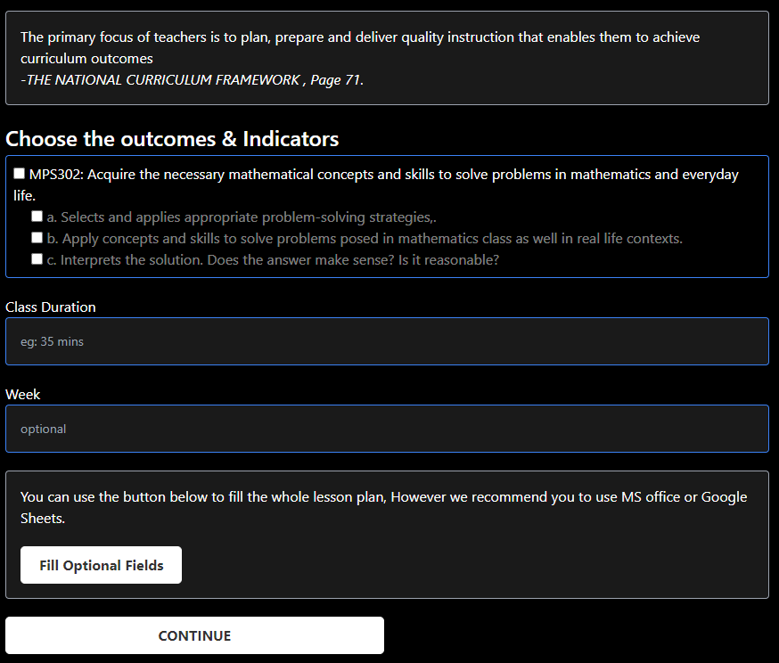
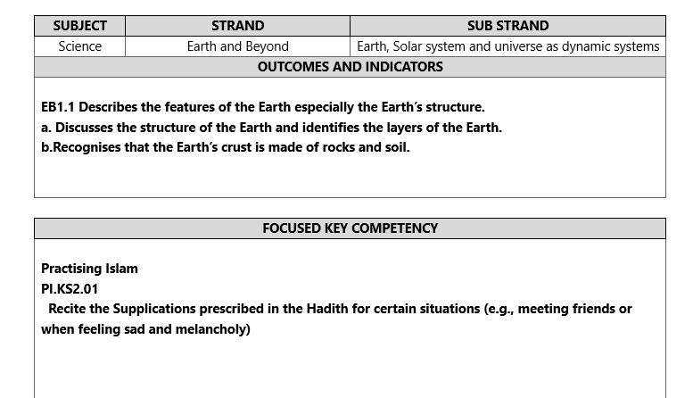
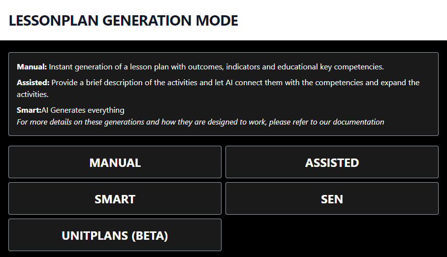

Lessonfuse at its core is a lesson plan generator that helps speed up the time teachers have to spend creating lesson plans to fit the standards detailed in the National Curriculum Framework.

With lessonfuse, teachers can focus on the main lesson plan instead of focusing on filling the outcomes, indicators, Educational Competencies and their indicators.

Because with lessonfuse those details are already on the lesson plan and the teacher does not need to worry about them.

While this is the initial focus of lessonfuse, we are also looking to expand the functionality of lessonfuse to include other features that will help teachers in their day to day work.

One of those features is the use of AI. while AI is not the main focus of Lessonfuse we have seen that most of the teachers are interested in the use of AI in Lessonfuse rather than the manual mode.
